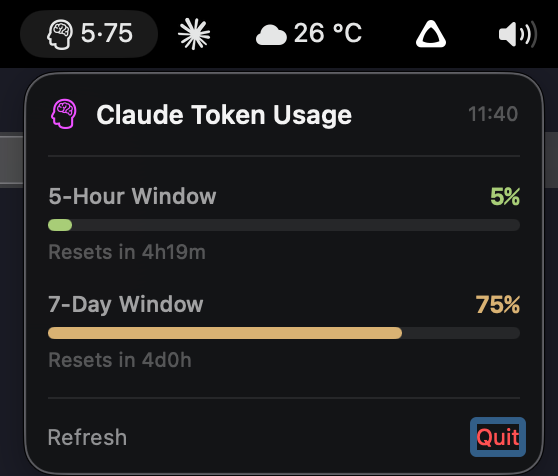

# ClaudeTokenBar

A lightweight macOS menu bar app that displays your Claude API token usage at a glance.



## What it shows

**Menu bar:** `5·75` — 5-hour window utilization and 7-day window utilization side by side.

**Dropdown (click to expand):**
- 5-Hour Window — usage bar, percentage, and time until reset
- 7-Day Window — usage bar, percentage, and time until reset
- Color-coded bars: green (< 50%), yellow (50-80%), red (> 80%)

## Requirements

- macOS 14.0+
- [Claude Code](https://claude.ai/code) installed and authenticated (the app reads the OAuth token from your macOS Keychain)
- Swift toolchain (Xcode Command Line Tools)

## Build & Install

```bash
git clone https://github.com/bernardogontijo/ClaudeTokenBar.git
cd ClaudeTokenBar
./build.sh
cp -r build/ClaudeTokenBar.app /Applications/
open /Applications/ClaudeTokenBar.app
```

## How it works

1. Reads the Claude Code OAuth token from macOS Keychain (`Claude Code-credentials`)
2. Polls `https://api.anthropic.com/api/oauth/usage` every 60 seconds
3. Displays the two rate-limit windows (5-hour and 7-day) in the menu bar
4. No data is stored or transmitted anywhere — everything stays local

## License

MIT
